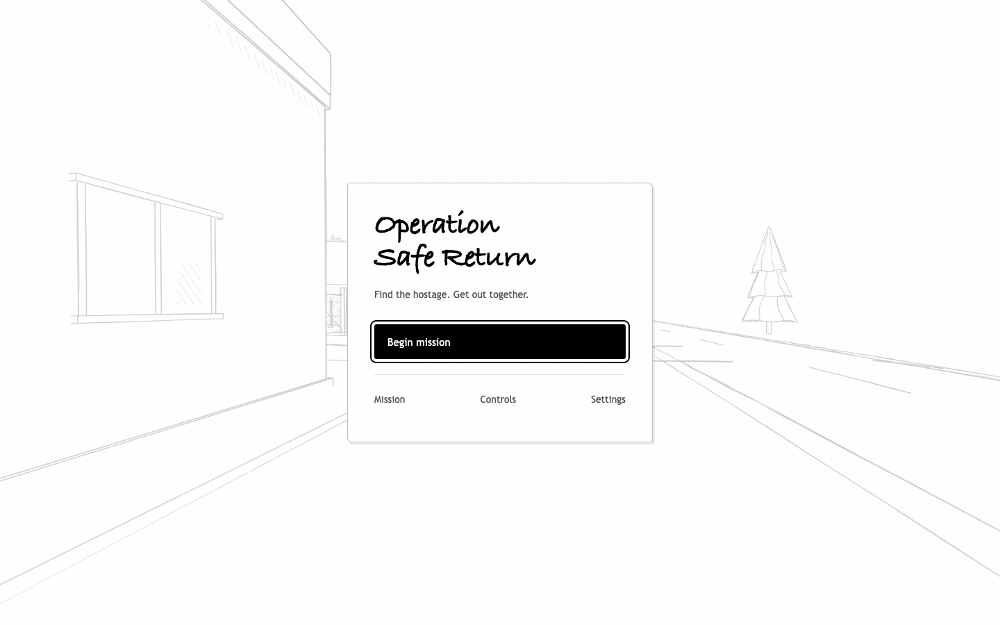
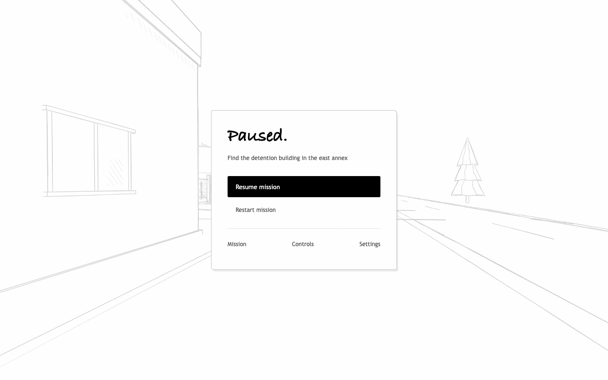
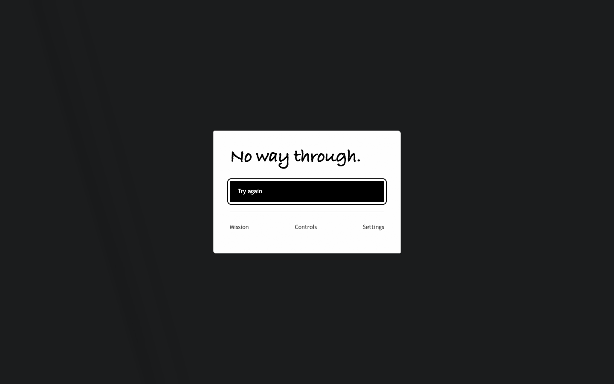

# Minimal game menus

The briefing previously combined the objective, tactical instructions, map, controls, audio, accessibility options, recovery actions, and session statistics. Each menu now serves one purpose and the initial screen contains 14 words, including its buttons.

## Research and decisions

- [Game Accessibility Guidelines: quick access to gameplay](https://gameaccessibilityguidelines.com/allow-the-game-to-be-started-without-the-need-to-navigate-through-multiple-levels-of-menus/): starting and resuming stay one click away. Reference pages are optional, with no required onboarding sequence.
- [Nielsen Norman Group: progressive disclosure](https://www.nngroup.com/articles/progressive-disclosure/): Mission, Controls, and Settings open separate pages. Route advice sits inside an optional disclosure on the mission map. Repeated instructions, the opening checklist, and failure statistics were removed.
- [Xbox Accessibility Guideline 112: UI navigation](https://learn.microsoft.com/en-us/xbox/accessibility/xbox-accessibility-guidelines/112): consistent Back buttons, Escape navigation, focus restoration, keyboard navigation, and visible focus indicators. Settings are available before starting.

The visual treatment keeps the existing white paper (#ffffff), light gray (#f5f5f5), black ink (#000000), secondary gray (#555555), Bradley Hand headings, and Trebuchet body text. A single compact sheet replaces the two-column briefing. The handwritten title carries the visual character; primary actions use black fill and supporting links stay quiet.

## Final behavior

| Screen | Main content |
| --- | --- |
| Start | Title, one-sentence premise, Begin mission |
| Pause | Current objective, Resume mission, Restart mission |
| Death | No way through. + Try again |
| Completion | Hostage safe, elapsed time, Play again |
| Mission | Current objective, map, optional route tips |
| Controls | Key reference |
| Settings | Volume, Mute, Reduced motion |

Mission, Controls, and Settings remain available from the main screens. There are no player-facing checkpoints. Try again resets the entire mission and enters play immediately; Restart mission on pause asks for confirmation. M opens the map directly from gameplay and M resumes; Escape goes back from subpages and resumes from pause.

Menu transitions follow controller events immediately so quickly opening the map, resuming, and pausing cannot leave the wrong page open while waiting for the next rendered frame.

## Validation

- Production build and existing player, VR, mission, and player-death suites passed.
- Agent-browser exercised native Start/Pause/M/Back/Restart controls and captured the screens in [evidence](evidence/).
- [check-menus.js](../../scripts/check-menus.js) passed 31 staged browser checks: page isolation, focus, keyboard navigation, audio/motion settings, rapid transitions, restart cancellation, death, fresh retries, and completion. [Results](evidence/checks.json).
- Reviewed 1440×900, 1024×600, 390×844, and 320×568 layouts. All controls are reachable without horizontal scrolling at the narrowest size. The map scales down on short desktop windows; long references scroll vertically.
- Browser error log was empty. These are menu checks, not a full rescue playthrough. Death and completion use staged runtime state; guards and pointer-lock fallback are controlled in the automated lifecycle check.

To rerun: start Vite, open a fresh game using agent-browser, wait for `window.__environment.mission.ready`, then run `agent-browser eval --stdin < scripts/check-menus.js`. Reload afterward to restore an untouched game.

