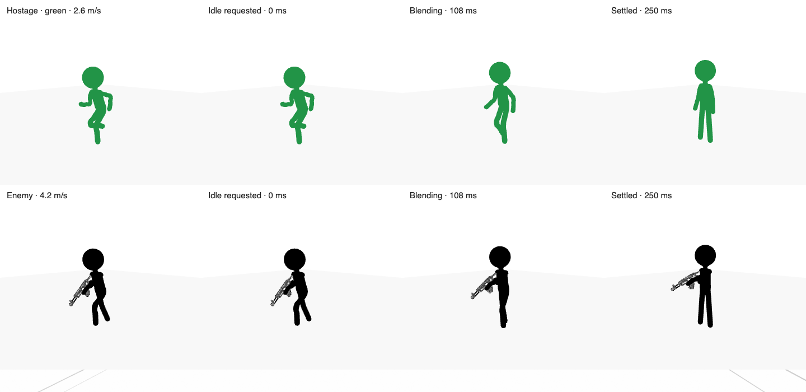

# NPC speed and state transitions

The hostage is now blue (`#2878d0`; see the [seating correction](../hostage-seat/README.md)) and runs at 2.6 m/s (previously 2.05). Enemy running is 4.2 m/s (previously 3.36); patrol walking is unchanged. Escort animation follows measured horizontal travel, and enemy running uses the shared 1.5× stride/cadence adaptation.

Mission actors use a 220 ms pose blend for locomotion and idle changes. The blend captures the last rendered bone positions and rotations, including procedural weapon posing, so interrupting a transition continues from what was on screen. The player restores the underlying pose before the next mixer update to avoid accumulating corrections. Temporary leg-reach compensation keeps feet above the floor without moving navigation anchors. Authored posture, flinch and death sequences retain their own transitions.

Validation:

- Build, gait, hostage route/boarding, combat posture, death and AI checks passed. One wall-clock-budgeted patrol check initially missed a reserve waypoint under parallel load; it passed when run separately. Old running-speed assertions were updated to the new balance value.
- `npm run test:npc-transitions`: real GLB skeletons, hostage and all five enemy weapons, multiple starting stride phases, immediate and interrupted run/walk/idle/aim changes at 30/60/144 fps, fixed leg lengths, foot clearance, pause, settled idle and hostage cowering.
- Agent-browser staged the actual loaded game actors with the real WebGL renderer. At the time of this motion check, the hostage was green and enemies black; the later blue revision is verified separately. Maximum start-pose difference was 0 for the hostage and below 0.000001 radians for the guard; browser errors were empty. This was focused visual verification, not a manual full mission playthrough.

Run `agent-browser eval --stdin < scripts/check-npc-motion.js` on a ready development game to recreate the contact sheet. This isolates actors for inspection; reload afterward.

