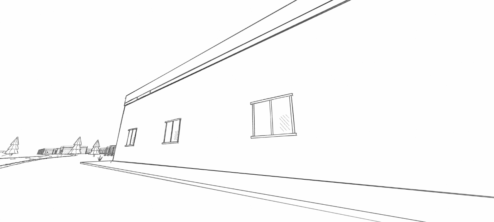
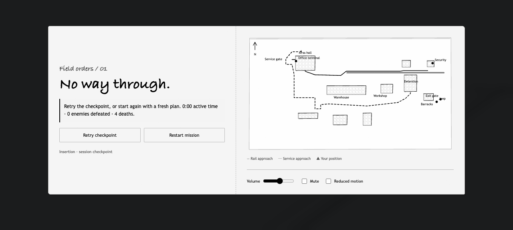

# First-person death sequence

Fatal damage now releases input and lowers the weapon while the camera falls backward to a supported head height. The head follows the body toward the sky, with a small ground-contact rebound and a slight resting tilt. A swept head volume checks solid walls and wire panels; backward travel stays on the current platform.

The shared sequence clock triggers ground contact at 1.06 seconds, settles the head by 1.44 seconds, finishes background dimming by 3.35 seconds, and reveals the menu from 3.7–4.25 seconds. Death has no circle or vignette. The entire background gradually blurs to 10 px and darkens uniformly to 92%, leaving the scene faintly visible. Reduced Motion keeps the camera stationary and uses an opacity fade without blur.

The world continues during the fall: airborne blood follows its physics and settles, corpse animations finish, NPCs move, projectiles and impacts expire, and security cameras keep turning. Guards cannot target or damage the dead player. The world pauses when the menu opens or the tab is hidden; the mission's active-time statistic stops at the fatal hit.

Combat shading now triggers only on confirmed damage. Nearby misses retain their passing sound without any shading or directional label. Hit shading is reduced from a 48% cap to 18%, and the separate brief damage shadow is reduced by the same proportion.

Audio combines an existing player-hit recording with a quiet descending pulse and breath, followed by a body-fall recording and low impact at ground contact. Combat audio clears at death; the cue continues while player input is paused. Volume, mute, hidden tabs, retry, inspection, and disposal retain their normal controls. No new external audio assets were added.

The death menu omits the briefing instructions so retry and restart remain visible on short screens. Retrying restores the camera, weapon transform, normal HUD, and soundscape. The full briefing remains available after retry.

## Verification

- `npm run build`
- `npm run test:player-death`: fall continuity at 30/60/144 fps, raised floors, walls, platform edges, extreme initial aim, Reduced Motion, weapon lowering, scope cleanup, and the real runtime's fatal-frame/menu/retry lifecycle.
- `node scripts/check-player.mjs scripts/polish-audio-checks.ts`: decoded recordings and procedural fallback, saturated source budget, single cues, mute/volume, and cleanup.
- Existing player-hit, weapon, player movement, and VR checks passed. The follow-up also passed the full AI and bullet suites and security checks.
- Authorized agent-browser review ran [the staged script](../../scripts/check-player-death.js) against the actual development mission. The normal render loop completed the sequence, kept the menu hidden until the background dimmed, produced one death cue and one ground-contact cue, and cleared all audio on the menu. It verified that death has no vignette, blur covers the entire background, airborne blood settles and expires, and an enemy death animation advances during the fall. Native audio had 96 decoded samples and a nonzero post-volume signal. This verifies signal output, not a subjective listening review.
- [Staged combat checks](../../scripts/check-bullet-juice.js) verified actual guard misses produce sound without shading; actual hits trigger the weaker feedback, which still obeys pause, recovery, Reduced Motion, retry and VR cleanup.
- A separate staged real AK guard shot took the player from 1 health to death. Normal Retry checkpoint and Resume mission clicks restored 100 health, 75° FOV, active movement, and no death overlay. Browser errors were empty.

These are staged integration checks, not a complete mission playthrough. Screenshots were inspected at a 1280 × 577 viewport:

| Falling | Settled, looking up |
| --- | --- |
|  |  |

| Background blur and dimming | Death menu |
| --- | --- |
|  |  |
