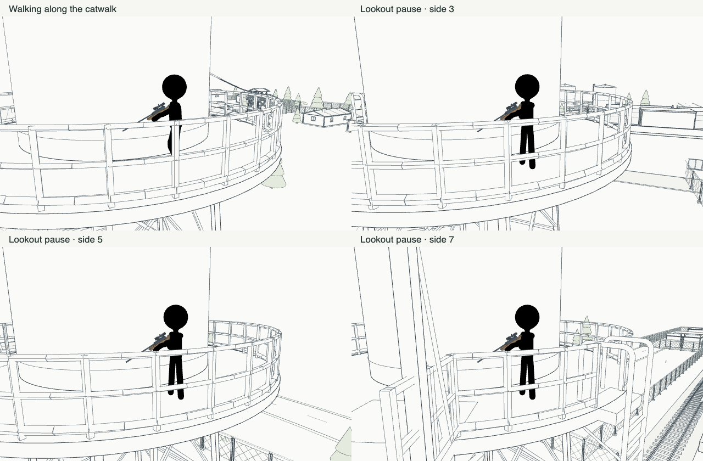

# Water-tower patrol

The water-tower marksman follows 16 adjacent points around the middle of the catwalk, at a radius of 3.7 m. After an initial 2–4 second pause, he walks at 1.25 m/s, passes two to five route segments, then stops for 3–7 seconds and turns outward to watch the compound. Both the next stopping point and pause duration use the director's existing seeded random generator.

Only perimeter patrols permit a sniper to move. Visual contact, investigation and alarms keep him at his current position; after losing contact and finishing the search, he resumes the same route. He waits for a blocked catwalk instead of sidestepping toward an open edge. The observation-tower sniper stays at his authored post.

Checkpoints preserve the selected stopping point and random state. Old checkpoints containing the stationary water-tower guard switch him to patrol when restored.

Validation:

- `npm run build`, `npm run test:ai`, `npm run test:map` and `npm run test:tower-patrol` passed.
- The dedicated check uses actual compound collision geometry and loaded character animations. It checks every route segment, full circuits, standing pauses, outward facing, combat fire, alarm handling and checkpoint continuation.
- The browser check used the real mission director and actors: 14 seconds of normal-speed playback, then 120 seconds of simulated patrol. It covered all eight sides, visited 45 waypoints, traveled 63.5 m and recorded zero path failures. Walking and relaxed lookout clips both played; the observation-tower guard remained still. No browser errors were reported.
- The browser check temporarily hides other guards and places the sensed player out of range to isolate idle patrol behavior. It restores the session afterward. Combat and alarm interruptions are covered separately by the dedicated check.

Reproduce the browser check on the running game with `agent-browser eval --stdin < scripts/check-tower-patrol.js`.

